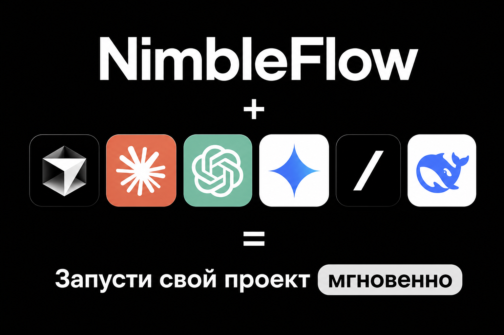

<div align="center">

# NimbleFlow

</div>

# Сэкономьте часы на написании повторяющегося кода, выпускайте продукты быстро и получайте прибыль!

Готовый каркас сайта на Next.js: лендинг, вход, кабинет, оплата, документы и AI.

Клонируешь репозиторий, заполняешь ключи — получаешь связанный проект. Это не облачный сервис и не набор кнопок. Это **исходный код твоего проекта**, который можно менять и деплоить куда угодно.

<div align="center">

---



Отдай этот репозиторий **ИИ**, опиши свой продукт — и допиливай каркас под себя или выдергивай то, что надо тебе, а не собирай auth, оплату, кабинет, интеграцию AI и документы с нуля!

<br />


</div>

---

## Что внутри

| Модуль | Что получаешь |
|--------|----------------|
| **Лендинг** | Продуктовая витрина: hero, возможности, тарифы, FAQ, CTA |
| **Auth** | Вход через Яндекс и VK ID (+ Dev Login для локалки) |
| **Кабинет** | Профиль, план Free/Pro, empty/paid состояния |
| **Оплата** | ЮKassa или Robokassa, создание платежа и webhooks |
| **Чеки 54-ФЗ** | опционально: `RECEIPT_ENABLED` + СНО/НДС в env |
| **Подтверждения** | OTP для email и телефона в профиле |
| **AI** | Чат в кабинете: `AI_PROVIDER` + `AI_API_KEY` |
| **Письма / SMS** | SMTP или Unisender, SMS.ru или console |
| **Документы** | Шаблоны оферты, политики ПДн, пользовательского соглашения |
| **SEO** | metadata, `sitemap.xml`, `robots.txt`, Open Graph |
| **Метрика** | Яндекс Метрика через `NEXT_PUBLIC_YANDEX_METRIKA_ID` |
| **Docs** | Гайды по OAuth, платежам, Метрике, ngrok и деплою; [карта модулей](docs/modules.md) |

---

## Архитектура

```text
src/
├── app/
│   ├── (marketing)/     # /, /login, /pricing, /legal/*, /payments/*
│   ├── (app)/           # /profile — кабинет
│   └── api/
│       ├── auth/        # [...nextauth] = Яндекс; VK ID
│       ├── payments/    # создание платежа
│       ├── ai/chat/     # чат с нейросетью
│       └── webhooks/    # yookassa, robokassa
├── components/
│   ├── ui/              # Button, Input, Card, …
│   ├── marketing/       # секции лендинга
│   ├── app/             # кабинет: аккаунт, подписка
│   └── profile/         # OTP, AI-чат
├── config/              # site, plans, env, legal
├── db/                  # Drizzle schema + runtime
└── lib/
    ├── auth/            # config.ts = Яндекс; vk-id/ = VK; verification/ = OTP
    ├── payments/        # checkout, finalize
    ├── yookassa/ · robokassa/
    ├── subscription/    # Free / Pro
    ├── email/ · sms/
    ├── ai/              # провайдеры нейронок
    ├── analytics/       # Яндекс Метрика
    └── seo/
```

Подробности модулей — в [`docs/modules.md`](docs/modules.md). Гайды setup — [`docs/`](docs/README.md).
Конфиг и секреты — через `.env` (см. [`.env.example`](.env.example)).

---

## Стек

| Слой | Выбор |
|------|--------|
| Framework | Next.js **16.2**, React **19.2** |
| Language | TypeScript **5.9** |
| UI | Tailwind CSS **4.3** |
| Auth | Auth.js **v5** — Яндекс, VK ID |
| Database | Drizzle ORM **0.45** — PostgreSQL или MySQL (`DB_PROVIDER`) |
| Payments | ЮKassa / Robokassa |
| AI | OpenRouter / OpenAI / Mistral / GenAPI / DeepSeek / Anthropic / Gemini / Grok / **GigaChat** (`AI_PROVIDER` + `AI_API_KEY`) |
| Email | SMTP или Unisender |
| SMS | SMS.ru |
| Validation | Zod **4.4** |
| Package manager | pnpm **10** |

---

## Быстрый старт

```bash
git clone https://github.com/nacosof/NimbleFlow.git
cd NimbleFlow
pnpm install
cp .env.example .env
```

Все переменные и подсказки «где взять» — в [`.env.example`](.env.example). Скопируй его в `.env` и заполни то, что нужно для работы:

- база данных: `DATABASE_URL`, `DB_PROVIDER`
- auth: `AUTH_SECRET`, `AUTH_YANDEX_*` / `AUTH_VK_*`
- оплата: `PAYMENT_PROVIDER` + ключи ЮKassa (`YOOKASSA_*`) или Robokassa (`ROBOKASSA_*`); чеки 54-ФЗ — `RECEIPT_ENABLED`, `RECEIPT_SNO`, `RECEIPT_VAT`
- нейросеть: `AI_PROVIDER`, `AI_API_KEY` (опционально `AI_MODEL`) — [`docs/setup-ai.md`](docs/setup-ai.md)
- почта / SMS: `EMAIL_PROVIDER` + SMTP/Unisender, `SMS_PROVIDER` + SMS.ru

Подробные гайды (OAuth, платежи, ngrok, деплой): **[`docs/`](docs/README.md)**.

```bash
pnpm db:push
pnpm dev
```

Открой http://localhost:3000

---

## Dev Login

Удобно при разработке: можно править кабинет и страницы без живой БД и OAuth.

1. В `.env` поставь `AUTH_DEV_LOGIN=true`
2. Запусти `pnpm dev`
3. Открой `/login` → **«Войти как Dev (локально)»**

Кнопка есть только при `AUTH_DEV_LOGIN=true` и только вне production. Сессия без базы. Подтверждение email/телефона и оплата в этом режиме не работают. Чат с AI работает, если задан `AI_API_KEY`.

---

## Страницы

| Путь | Назначение |
|------|------------|
| `/` | Лендинг |
| `/login` | Вход |
| `/pricing` | Тарифы Free / Pro |
| `/profile` | Кабинет |
| `/legal/terms` · `/legal/offer` · `/legal/privacy` | Юр. шаблоны |
| `/payments/success` · `/payments/fail` | Возврат после оплаты |

---

## Definition of Done

Проверь путь продукта после настройки `.env`:

1. `pnpm install` → `pnpm db:push` → `pnpm dev`
2. `/login` — вход через Яндекс или VK ID
3. `/profile` — кабинет, OTP email/телефона
4. `/pricing` или кабинет — тестовая оплата Pro (ЮKassa или Robokassa + webhook; локально см. [`docs/setup-webhooks-ngrok.md`](docs/setup-webhooks-ngrok.md))
5. В профиле план = **pro**
6. Письмо welcome / payment-succeeded уходит через SMTP|Unisender или пишется в лог (если почта не настроена)

Dev Login закрывает только UI без БД — оплата и OTP в нём не работают.
